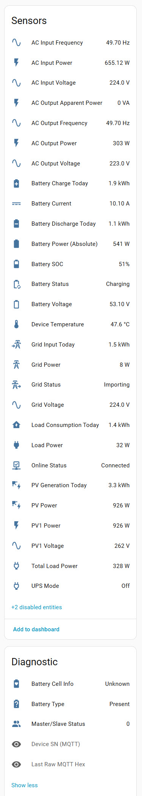
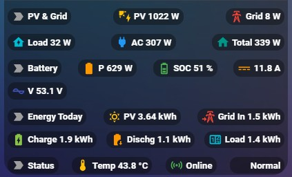

# LumentreeHA

[](https://github.com/custom-components/hacs)
[](https://github.com/ngoviet)
[](https://github.com/ngoviet/lumentreeHA/releases)
[](https://github.com/ngoviet/lumentreeHA)

[](https://my.home-assistant.io/redirect/hacs_repository/?owner=ngoviet&repository=lumentreeHA&category=integration)

Home Assistant integration for Lumentree Solar Inverters (SUNT series) with real-time monitoring via MQTT and HTTP API.



## Features

- **Real-time monitoring** via MQTT connection
- **HTTP API integration** for device information and daily statistics
- **Comprehensive sensor support** for:
  - PV power generation (PV1, PV2, Total)
  - Battery status (voltage, current, SOC, power, charging/discharging)
  - Grid connection (voltage, frequency, power import/export)
  - Load monitoring and power consumption
  - Device temperature and health
  - UPS mode detection
  - Master/Slave status
- **Daily statistics tracking** with historical data
- **Battery cell monitoring** (if supported by device)
- **Configurable polling intervals**
- **Robust error handling** and reconnection logic



## Supported Devices

- **SUNT-4.0KW-H** (Primary support)
- **Other SUNT series inverters** (Compatible)

## Installation

### HACS (Recommended)

[](https://my.home-assistant.io/redirect/hacs_repository/?owner=ngoviet&repository=lumentreeHA&category=integration)

1. Open **HACS** in your Home Assistant instance
2. Go to **Integrations**
3. Click the **three dots** (⋮) in the top right corner
4. Select **Custom repositories**
5. Add this repository:
   - **Repository**: `https://github.com/ngoviet/lumentreeHA`
   - **Category**: `Integration`
6. Click **Add**
7. Search for **"LumentreeHA"** and install it
8. Restart Home Assistant
9. Add the integration via **Configuration** → **Integrations**

### Manual Installation

1. Download the latest release from [GitHub](https://github.com/ngoviet/lumentreeHA/releases)
2. Copy the `custom_components/lumentree` folder to your Home Assistant `custom_components/` directory
3. Restart Home Assistant
4. Add the integration via **Configuration** → **Integrations**

## Configuration

### Adding the Integration

1. Go to **Configuration** → **Integrations**
2. Click **Add Integration**
3. Search for **"Lumentree Inverter"**
4. Enter your device information:
   - **Device SN**: Serial number of your inverter (e.g., `H240909099`)
   - **Device ID**: Device ID (usually same as SN)
   - **Device Name**: Friendly name for your device
   - **HTTP Token**: Authentication token from Lumentree app
5. Click **Submit**


## Requirements

- **Home Assistant**: 2022.7.0 or later
- **Python packages**:
  - `aiohttp>=3.8.0`
  - `paho-mqtt>=1.6.0`
  - `crcmod>=1.7`

## Sensors

### Real-time Sensors (MQTT)
- **PV Power**: Total solar generation power
- **PV1/PV2 Power**: Individual PV string power
- **Battery**: Voltage, current, SOC, power, status
- **Grid**: Voltage, frequency, power (import/export)
- **Load**: Power consumption
- **AC Output**: Voltage, frequency, power, VA
- **Device**: Temperature, UPS mode, master/slave status

### Statistics Sensors (HTTP API)
#### Daily Statistics
- **PV Generation**: Daily solar energy production
- **Battery Charge/Discharge**: Daily battery energy flow
- **Grid Import**: Daily grid energy import
- **Load Consumption**: Daily load energy usage
- **Essential Load**: Daily essential load consumption

#### Monthly Statistics
- **Monthly totals** for all categories (PV, Grid, Load, Essential, Charge, Discharge)
- **Daily arrays** for charting monthly trends

#### Yearly Statistics
- **Yearly totals** aggregated from monthly data

#### Lifetime Statistics
- **Total (lifetime) statistics** from device installation to now

### Binary Sensors
- **Online Status**: Device connectivity status
- **UPS Mode**: Whether device is in UPS mode

## Troubleshooting

### Common Issues

**"Unrec len" errors in logs:**
- ✅ **Fixed in v2.0**: Parser now handles 202-byte data packets correctly
- Make sure you're using the latest version

**No data from sensors:**
- Verify your **HTTP token** is correct
- Check device is **online** in Lumentree app
- Review MQTT connection status in logs
- Ensure device SN and ID are correct

**Integration won't load:**
- Verify all **requirements** are installed
- Check Home Assistant **logs** for errors
- Ensure device SN and ID match exactly
- Try removing and re-adding the integration

**MQTT connection issues:**
- Check internet connectivity
- Verify MQTT broker is accessible
- Review firewall settings

### Debug Logging

Enable detailed logging to troubleshoot issues:

```yaml
logger:
  default: info
  logs:
    custom_components.lumentree: debug
    homeassistant.components.mqtt: debug
```

## Changelog

### 3.1.0 (2025-01-XX)
- ✨ **NEW**: Added daily, monthly, yearly, and total (lifetime) statistics tracking
- ✨ **NEW**: Added DailyStatsCoordinator for real-time daily statistics
- ✨ **NEW**: Added MonthlyStatsCoordinator with daily arrays for monthly charts
- ✨ **NEW**: Added YearlyStatsCoordinator for yearly statistics aggregation
- ✨ **NEW**: Added TotalStatsCoordinator for lifetime statistics tracking
- ✨ **NEW**: Added cache management system with services/aggregator.py and services/cache.py
- 🚀 **PERFORMANCE**: Optimized API calls with parallel requests (3x faster)
- 🚀 **PERFORMANCE**: Optimized cache I/O with batch processing (30-50% faster backfill)
- 🚀 **PERFORMANCE**: Removed duplicate coordinator to reduce API calls by 50%
- 🚀 **PERFORMANCE**: Added adaptive exponential backoff for rate limiting
- 🔧 **FIXED**: Updated iot_class to cloud_polling (correct classification)
- 📊 **ENHANCED**: Better statistics management with automatic backfill and gap filling

### 3.0.0 (2025-10-XX)
- Major architecture refactoring
- Improved error handling and stability

### 2.0.0 (2025-01-10)
- ✅ **Fixed MQTT parser** for 202-byte data packets
- ✅ **Improved error handling** and reconnection logic
- ✅ **Enhanced logging** with better error messages
- ✅ **Added support** for extended data format
- ✅ **Optimized performance** and memory usage

### 1.0.0 (2024-12-01)
- 🎉 **Initial release**
- Basic MQTT and HTTP integration
- Core sensor support
- Config flow implementation

## Contributing

We welcome contributions! Here's how you can help:

1. **Fork** the repository
2. **Create** a feature branch (`git checkout -b feature/amazing-feature`)
3. **Commit** your changes (`git commit -m 'Add amazing feature'`)
4. **Push** to the branch (`git push origin feature/amazing-feature`)
5. **Open** a Pull Request

### Development Setup

1. Clone the repository
2. Install development dependencies
3. Make your changes
4. Test with your Lumentree device
5. Submit a pull request

## Support

- 📧 **GitHub Issues**: [Report bugs or request features](https://github.com/ngoviet/lumentreeHA/issues)
- 💬 **Home Assistant Community**: [Join the discussion](https://community.home-assistant.io/)
- 📖 **Documentation**: Check this README and code comments

## License

This project is licensed under the **MIT License** - see the [LICENSE](LICENSE) file for details.

## Acknowledgments

- **Lumentree** for providing the API and MQTT protocol
- **Home Assistant Community** for support and feedback
- **HACS** for making installation easy
- **Contributors** who help improve this integration

## Donate

If you find this integration useful, consider supporting the development:

[](https://www.buymeacoffee.com/ngoviet)

---

**Made with ❤️ for the Home Assistant community**