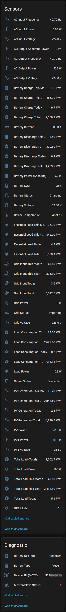
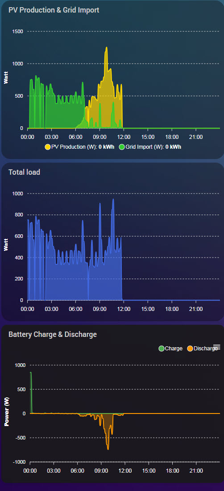
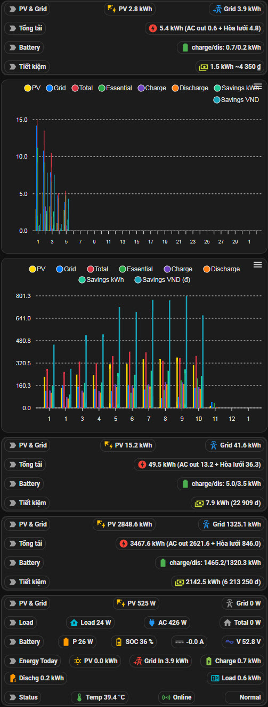

# Lumentree Solar Inverter — Home Assistant Integration

[](https://github.com/custom-components/hacs)
[](https://github.com/ngoviet/lumentreeHA/releases)
[](https://github.com/ngoviet/lumentreeHA/stargazers)
[](https://buymeacoffee.com/ngoviet)
[](https://github.com/sponsors/ngoviet)

<a href="https://my.home-assistant.io/redirect/hacs_repository/?owner=ngoviet&repository=lumentreeHA&category=integration" class="my badge" target="_blank"></a>

> **Tôi là người Việt, tự mình duy trì dự án này.** Nếu integration này giúp bạn theo dõi và tiết kiệm tiền điện, hãy [mua tôi một cốc cà phê](https://buymeacoffee.com/ngoviet) ☕ — mỗi cốc = 50,000 VND = động lực để tôi tiếp tục phát triển.

<p align="center">
  <a href="https://buymeacoffee.com/ngoviet">
    
  </a>
</p>

---

High-performance **Home Assistant custom integration** for **Lumentree hybrid solar inverters** (SUNT series). Real-time monitoring via **MQTT (Modbus)**, historical energy statistics via **HTTP API**, and comprehensive battery management. Track solar PV generation, grid import/export, battery SOC, and calculate electricity cost savings in VND.

---

## Screenshots

### Sensors Overview


### Dashboard — Energy Charts (24h)


### Dashboard — Statistics Summary


---

## Features

### Real-time Data (MQTT — 5s polling)
- **PV Power**: Solar generation (W) — PV1 + PV2
- **Battery Management**: Power, voltage, current, SOC (%), status (Charging/Discharging)
- **Grid Power**: Import/export power + status
- **Load Power**: Total consumption monitoring
- **AC Output**: Voltage, frequency, power, apparent power, current
- **AC Input**: Voltage, frequency, power, current
- **Battery Settings**: Capacity, charge/discharge current limits, charge voltages, protection thresholds
- **Device**: Temperature, online status, UPS mode, serial number, inverter/generator power
- **Battery Cells**: Individual cell voltage monitoring

### Daily Statistics (HTTP API — 5min refresh)
- PV Generation, Battery Charge/Discharge, Grid Import, Load Consumption
- Essential Load, Total Load, Energy Saved (kWh), Cost Savings (VND)
- **288-point 5-minute series** for detailed charts

### Monthly Statistics
- 7 metrics: PV, Charge, Discharge, Grid, Load, Essential, Total Load
- Saved (kWh) and Savings (VND) as state attributes
- **Daily arrays** for month-view charts (1-31 days)

### Yearly Statistics
- 7 metrics with **monthly arrays** for year-view charts (1-12 months)
- Historical data across multiple years via disk cache

### Lifetime/Total Statistics
- Cumulative totals across all available years
- Auto-aggregated from yearly data

### Performance
- **40-50% faster** parsing with struct caching
- **3x faster** API calls with concurrent requests
- **20-30% lower** memory with `__slots__`

> 💡 **Người dùng báo cáo tiết kiệm 200,000-500,000 VND/tháng tiền điện** nhờ theo dõi chính xác sản lượng điện mặt trời và tiêu thụ. Nếu integration này giúp ích cho bạn, [ủng hộ tôi một cốc cà phê](https://buymeacoffee.com/ngoviet) ☕

---

## Requirements

- **Home Assistant**: 2024.4+ (`config_flow.py` imports `ConfigFlowResult`, added in 2024.4; `hacs.json` still declares `2023.1.0`)
- **Python**: 3.11+ (the coordinators use `asyncio.timeout`, added in 3.11; the parser and sensor modules also annotate signatures with `X | None` without `from __future__ import annotations`, which Python 3.9 evaluates at import time and rejects)
- **Dependencies**: aiohttp>=3.8.0, paho-mqtt>=1.6.0, crcmod>=1.7
- **Network**: Internet (API + MQTT to `lesvr.suntcn.com`)

---

## Installation

### HACS (Recommended)
1. Open **HACS** → **Integrations** → **Custom Repositories**
2. Add `https://github.com/ngoviet/lumentreeHA` (Integration type)
3. Install **Lumentree Inverter** → Restart HA

### Manual
1. Download [latest release](https://github.com/ngoviet/lumentreeHA/releases)
2. Extract to `custom_components/lumentree/` in your HA config
3. Restart Home Assistant

---

## Configuration

1. **Settings** → **Devices & Services** → **Add Integration**
2. Search **Lumentree Inverter**
3. Enter **Device ID** (format: `H240909079` — found on device label or Lumentree app)
4. Follow setup wizard

---

## Available Entities

### Real-time Sensors (48 entities enabled, 55 defined)
| Category | Sensors |
|----------|---------|
| Power | PV Power, PV1, PV2, Battery, Grid, Load, Total Load, AC Output, AC Input, Apparent Power, Generator, CT Trickle Feed |
| Voltage | Battery, PV1, PV2, Grid, AC Output, AC Input, Equalizing/Boost/Float Charge Voltage, Battery Low Voltage Protection, Battery Recovery Voltage |
| Current | Battery, AC Input, AC Output, Battery Maximum Charge Current, Maximum Discharge Current |
| Energy | PV Input Today |
| Frequency | AC Output, AC Input |
| Status | Battery SOC (%), Battery Status, Grid Status, Battery Type, UPS Mode, Master/Slave, AI Mode, Self-Consumption Ratio |
| Setting (diagnostic) | Battery Capacity, Low Capacity Cutoff Point, Protecting Recovery Point, Equalizing Charge Interval, Equalizing Charge Time, Grid Type, AC Output Frequency Setting, Charge From AC, AC Coupling |
| Info (diagnostic) | Device Temperature, Work Mode, Battery Mode, Firmware Version, Controller Version, Battery Cell Info, MQTT Device SN |

Seven real-time sensors ship disabled by default (PV1/PV2 power and voltage, AC Input Voltage, MQTT Device SN, Last Raw MQTT Hex); enable them in the entity registry if you need them.
See [register availability by frame length](docs/api/REGISTER_MAP.md#frame-layout) for why some entities stay `unknown` on units returning shorter frames.

### Statistics Sensors (28 entities)
| Period | Metrics | Refresh |
|--------|---------|---------|
| Daily (7) | PV, Charge, Discharge, Grid, Load, Essential, Total Load | 5 min |
| Monthly (7) | Same as Daily | 5 min |
| Yearly (7) | Same, plus monthly arrays as attributes for charting | 5 min |
| Total (7) | Lifetime cumulative sums | 5 min |

Saved energy (kWh) and cost savings (VND) are exposed as state attributes on the statistics sensors, not as separate entities.

### Binary Sensors (2 entities)
- Online Status, UPS Mode

---

## Troubleshooting

### No entities after setup
- Restart Home Assistant
- Check logs: `custom_components.lumentree` for errors
- Verify network access to `lesvr.suntcn.com:1886` (MQTT) and `lesvr.suntcn.com:80` (HTTP)

### Sensors stuck / not updating
- MQTT sensors freeze → integration auto-reconnects within 2 minutes
- Stats sensors → check if daily coordinator is updating

### Enable debug logging
```yaml
logger:
  logs:
    custom_components.lumentree: debug
```

---

## About the Developer

<p align="center">
  <b>Tôi là người Việt Nam 🇻🇳 — một mình xây dựng và duy trì integration này.</b><br/>
  Dành <b>200+ giờ</b> phát triển, sửa lỗi, và cập nhật để integration hoạt động ổn định.<br/>
  <b>Mục tiêu: $20/tháng</b> — đủ để tôi có động lực tiếp tục cập nhật lâu dài.<br/><br/>
  <a href="https://buymeacoffee.com/ngoviet">
    
  </a>
</p>

---

## Support This Project

Nếu integration này giúp bạn tiết kiệm tiền điện, hãy ủng hộ tôi:

### Quốc tế
- [☕ Buy Me A Coffee](https://buymeacoffee.com/ngoviet) — Credit card, Apple Pay, PayPal
- [💖 GitHub Sponsors](https://github.com/sponsors/ngoviet) — Zero-fee recurring sponsorship

### Việt Nam
- **VietQR** — Quét mã chuyển khoản ngân hàng (miễn phí)
- **Momo** — Chuyển tiền qua ví Momo

*(QR codes coming soon — đang chờ thông tin tài khoản)*

---

## Changelog

See [CHANGELOG.md](CHANGELOG.md) or [GitHub Releases](https://github.com/ngoviet/lumentreeHA/releases) for detailed version history.

---

**Made with ❤️ by a Vietnamese developer — [Buy me a coffee](https://buymeacoffee.com/ngoviet) if this helps you.**
